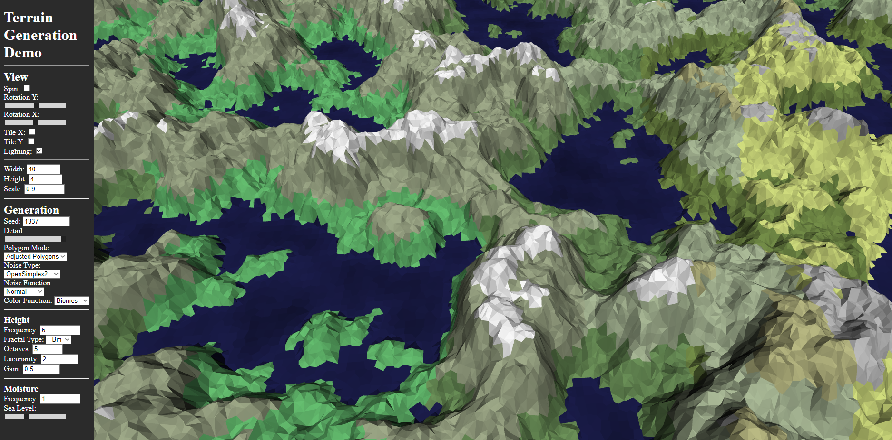

# Terrain Generation Demo

This is a small JavaScript WebGL 2.0 program that uses [FastNoiseLite](https://github.com/Auburn/FastNoiseLite) to generate a small model terrain.

It uses various methods from [Red Blob Games](https://www.redblobgames.com), who provided exquisite examples and blogs on procedural map generation. The two referenced were ["Making maps with noise functions"](https://www.redblobgames.com/maps/terrain-from-noise/) and ["Polygon Map Generation for Games"](http://www-cs-students.stanford.edu/~amitp/game-programming/polygon-map-generation/).

This was created for the technical demo presentation for COM S 437 at Iowa State University in Spring 2024.

To run, simply open index.html in your browser.